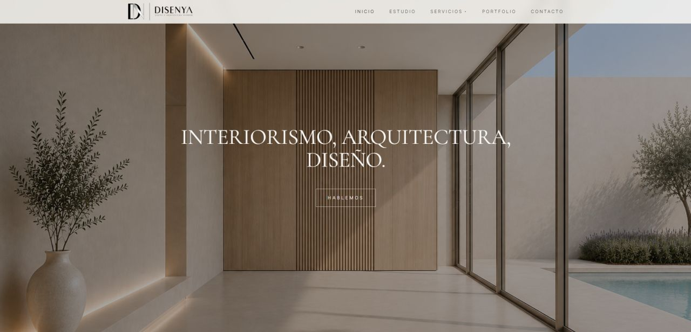
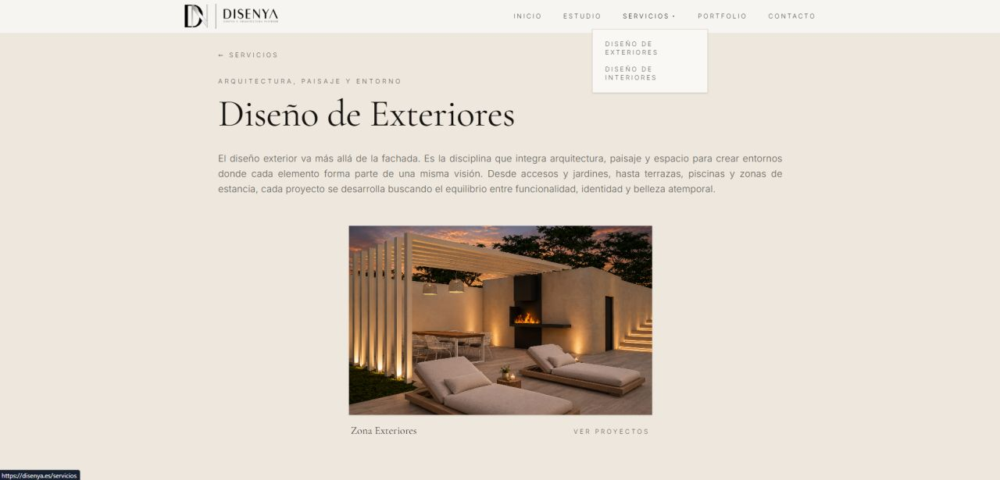
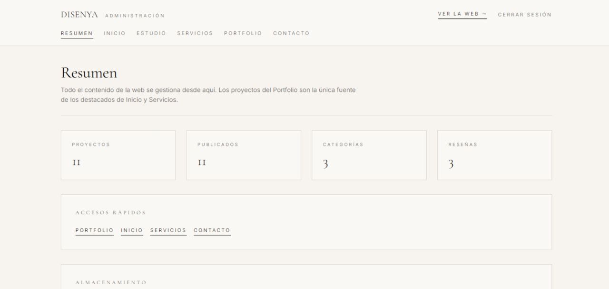
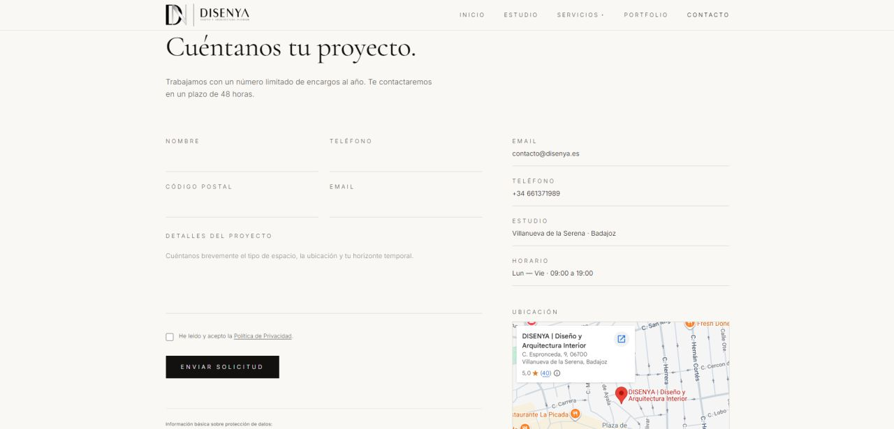
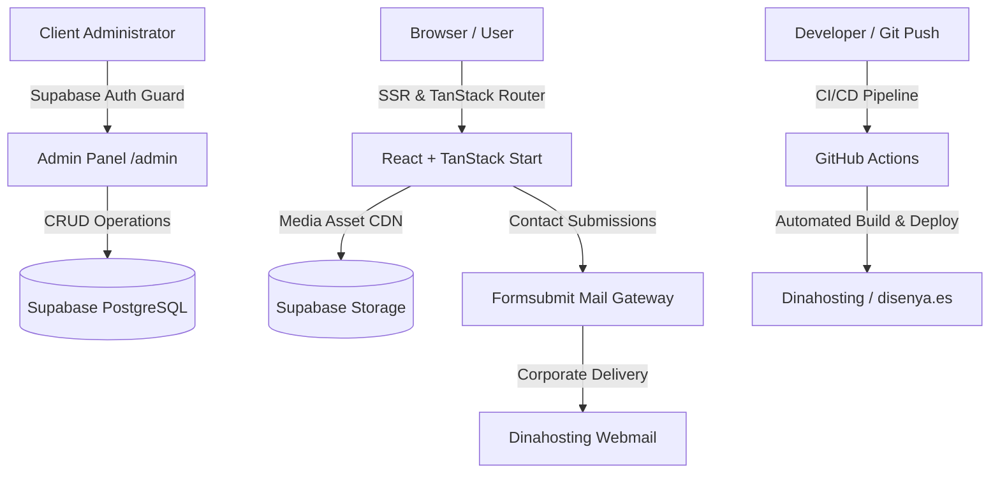

# Disenya Studio · Architecture Case Study & Engineering Overview

> Full-stack architecture case study and engineering breakdown for **DISENYA** (an interior design and architecture firm based in Villanueva de la Serena, Spain).

[](https://disenya.es)
[](https://tanstack.com/start)
[](https://tailwindcss.com)
[](https://supabase.com)
[](https://github.com/features/actions)

---

## 📸 Interface & System Preview

| Hero Landing (SSR) | Studio Services & Routing |
|:---:|:---:|
|  |  |

| Custom Backoffice (CMS Panel) | Contact Inquiries & Location |
|:---:|:---:|
|  |  |

---

## 🎯 Business Context & Engineering Challenge

Traditional small-business sites frequently rely on bloated WordPress templates with recurring plugin subscription fees, slow First Contentful Paint (FCP) metrics, and complex administrative interfaces.

The engineering goals were defined as follows:
1. **High Performance & Modern SEO:** Implement Server-Side Rendering (SSR) via TanStack Start to ensure immediate document delivery and deterministic search engine indexing.
2. **Autonomous Content Management:** Deliver an internal, custom-built admin panel (`/admin`) allowing the client to manage project statuses (`Draft` / `Published`), categories, and customer reviews without modifying source code.
3. **Zero Software Retainers:** Leverage Supabase (PostgreSQL + Object Storage CDN) to provide an enterprise-grade backend infrastructure without recurrent SaaS or plugin licensing costs for the client.
4. **Automated CI/CD Delivery:** Automate the build and deployment lifecycle using GitHub Actions to deploy validated releases directly to the Dinahosting production environment upon git push.

---

## 🛠️ Architecture & Tech Stack



* **Frontend:** **React** structured with **TanStack Start**, leveraging SSR for speed and TanStack Router for type-safe route trees (e.g. `/servicios/$slug`).
* **Styling & Design System:** **Tailwind CSS** implementing a minimalist architectural art direction tailored to high-end interior design.
* **Backend as a Service (BaaS):** **Supabase (PostgreSQL)** for relational data persistence.
* **Authentication & Access Control:** Strict role-based protection on `/admin` routes powered by Supabase Auth (`Auto Confirm` user onboarding).
* **Object Storage:** High-resolution architectural photography served directly from public **Supabase Storage** CDN buckets to minimize application bundle size.
* **Infrastructure & CI/CD:** Hosted under a custom domain with forced HTTPS (Let's Encrypt SSL) and automated production delivery via **GitHub Actions**.

---

## 💡 Key Implementation Details

### 1. Robust Schema Validation & Submission Pipeline (Zod + Formsubmit)
Client contact inquiries are strictly validated on the client side using Zod before assembling a programmatic POST payload to the notification relay:

```typescript
const schema = z.object({
  nombre: z.string().trim().min(2, "Nombre demasiado corto").max(80),
  telefono: z.string().trim().min(6, "Teléfono no válido").max(20),
  cp: z.string().trim().regex(/^\d{4,5}$/, "Código postal no válido"),
  email: z.string().trim().email("Email no válido").max(120),
  detalles: z.string().trim().min(10, "Cuéntanos un poco más").max(1000),
});

// Dynamic form submission to notification gateway
const fields = {
  ...values,
  _subject: `Nueva solicitud de proyecto de ${values.nombre} (Disenya)`,
  _template: "table",
  _captcha: "false",
};
```

### 2. Native Dynamic Admin Panel
Rather than embedding heavy third-party headless CMS systems, a custom backoffice was engineered into the application architecture. It enables direct control over database records, dynamic project highlights, and real-time metadata modifications.

### 3. Decoupled Cloud Media Delivery
Critical media assets (such as high-res brand photography and logos) are decoupled from the static build and served directly from public CDN buckets on Supabase Storage, maintaining optimal bundle sizes and fast First Contentful Paint.

---

## 🔒 Source Code Confidentiality

> **Notice:** Because this application operates in production as commercial software for an enterprise client, the private codebase repository is restricted. This repository serves as a technical architecture case study and engineering showcase.

Developed and maintained by **[Rubén Flores Calderón](https://www.linkedin.com/in/ruben-flores-calderon)**.
